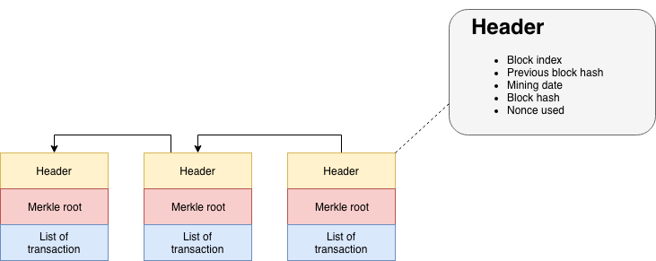
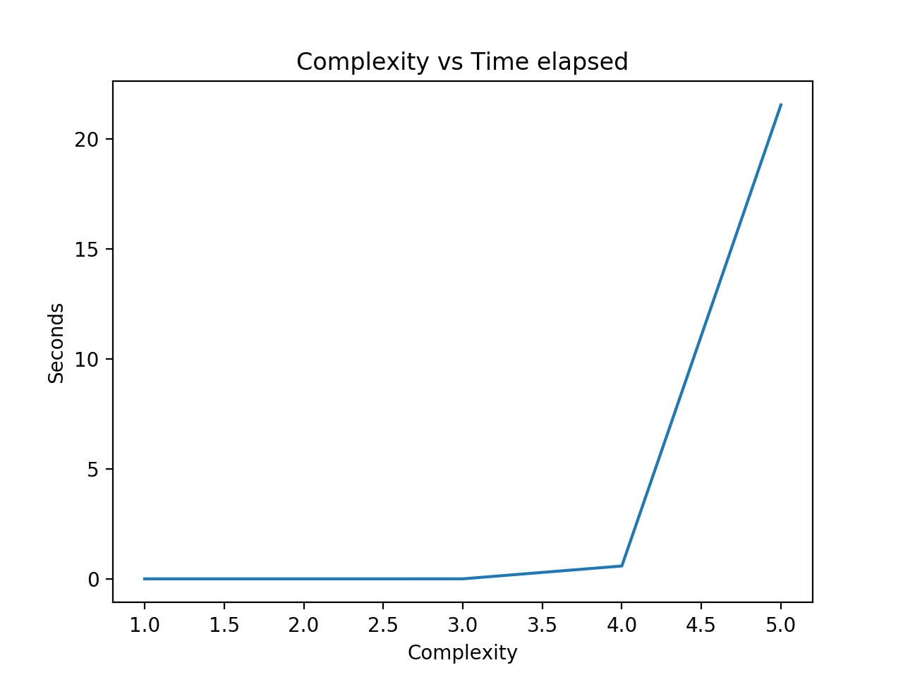

# Simplified Blockchain

This project is a simplified version of a Blockchain developed as part of a network security class.

Python 3.7 has been used for this project.

## How to launch the project ?

1. Clone the repository

2. If you're using *virtualenv*, install the requirements to get all the packages necessary to run the program.

```
pip install -r path/to/requirements.txt
```

3. Run the program

```
python main.py
```

## Blockchain

Blockchain is a storage and data transmission technology which is secure and doesn't rely on a central control point.

By extension, a blockchain is a database which contains the history of all the exchanges between its users since its creation.

This database is secure and shared by its users without intermediary. This allows to each individual to check the validity of the chain.

## The project

This project is composed of two main parts :

1) An analysis of the time needed to find a nonce matching a complexity between one and x. A nonce is a value added at the end of a data to make its hash match a certain complexity.

2) The creation of a Blockchain populated with random transactions.

### Analysis

The different blocks of this simplified Blockchain are composed of :

- Header including :
    - Block index
    - Previous block hash
    - Mining date
    - Block hash
    - Nonce used  

- Merkle root

- List of transaction



In order to mine a block, you need to find a hash that matches a certain complexity. In this case, we want to have *x* amount of *0* as the first part of our hash. To find that particular hash, we add data, the nonce, at the end of the original data.

Example :

Hash(Header + Merkle root + List of transaction) gives us :

 2cb4b1431b84ec15d35ed83bb927e27e8967d75f4bcd9cc4b25c8d879ae23e18

 Let's say we want to respect a complexity of two, we then need to find a nonce which give us 00 at the beginning of the hash.

If we do Hash(Header + Merkle root + List of transaction + 3344) we find :

00f757f901fc3c090aca09b828ecf0c9ddfa8e4a4b25c546f1d4ffa0e893828b

We respect this requirement. Our hash is then :
 00f757f901fc3c090aca09b828ecf0c9ddfa8e4a4b25c546f1d4ffa0e893828b and our nonce is 3344.

In this first part, the goal is to find out how much time is needed to find the nonce for a certain data. In the following example, we will use the word *blockchain* and make the complexity change from 1 to 5.

We then obtain the following graph :



### Blockchain

The main goal of this project is to create a simplified Blockchain. In order to do so, it is possible to add random transaction to a block which can then be added to the blockchain.

When a block is added to the blockchain, all the blocks preceding it are checked. If Hash(Header (without nonce and hash) + Merkle root + List of transaction + Nonce) don't match the hash indicated in the header then no block can be added.

Exemple :

```python
NB_BLOCK = 3
NB_TRANSACTION = 4
COMPLEXITY = 3

# Creation of a random list of transaction
listTransaction = [CreateRandomTransactions(NB_TRANSACTION) for _ in range(NB_BLOCK)]

blockchain = Blockchain(COMPLEXITY)

for i in range(NB_BLOCK):
    blockchain.addBlock(Block(i, datetime.datetime.now(), listTransaction[i]))
    blockchain.mine()

# Here we modifier the hash of the block 1 for fun
blockchain.listBlock[1].addBlockHash("orsgb22342")

blockchain.addBlock(Block(3, datetime.datetime.now(), listTransaction[0]))
blockchain.mine()
blockchain.displayBlockchain()
```


```
######### Blockchain #########

[VERIFICATION] - Pass
[VERIFICATION] - Pass
[VERIFICATION] - Pass
[VERIFICATION] - The block 1 is not correct ! Cannot add the block 3

##########
Block : 0
- Hash previous block :
- Mining Date : 2019-06-25 16:41:39.576844
- Block Hash : 000354a13062a76c9f3a95e18da0b3d14b757abcb2251f30587fd2caa6988d23
- Nonce : 5441808
- Merkle root : 4dea7eef024e1954680faac0089484dab41843186568d133cb1efefef41c4cd9
- Number of transaction : 4
##########

    ^
    |

##########
Block : 1
- Hash previous block : 000354a13062a76c9f3a95e18da0b3d14b757abcb2251f30587fd2caa6988d23
- Mining Date : 2019-06-25 16:41:39.586927
- Block Hash : orsgb22342
- Nonce : 2657712
- Merkle root : 964af3c5065392da50a9834b3e25bf0c43fe7df954badd906372404417edd080
- Number of transaction : 4
##########

    ^
    |

##########
Block : 2
- Hash previous block : 000f3af7883ab3291cc62189287a2abe718ae90b117be1db37a36719c0ba7ffd
- Mining Date : 2019-06-25 16:41:39.655179
- Block Hash : 000396b447616418169812db84a030a48128419b675e201e2391a14535ad5510
- Nonce : 7351239
- Merkle root : c8af9cc1e71c0bfaf2795ef4734747e48ab8fbb42e10a75682c27752524c3def
- Number of transaction : 4
##########
```
